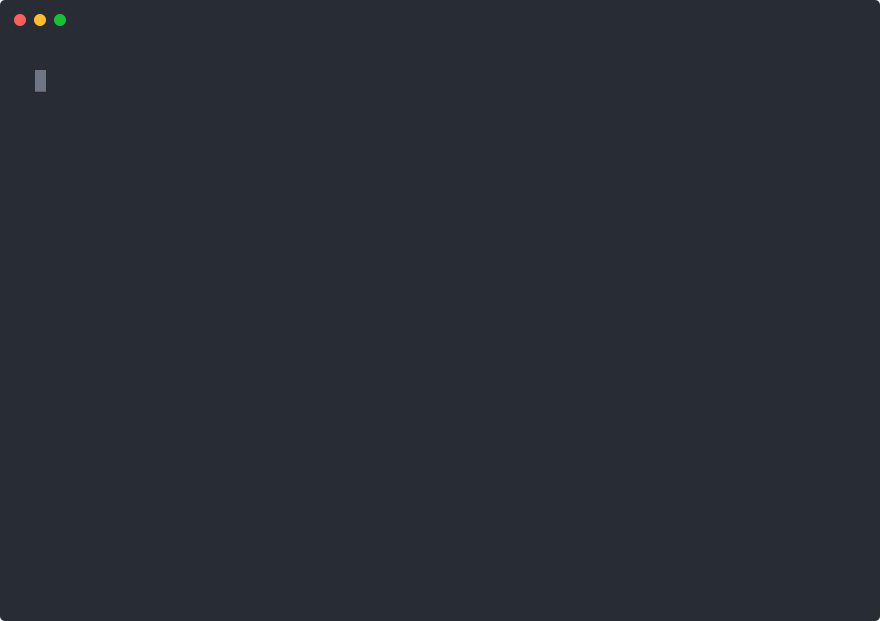

# kubectl-schemagen

[](https://github.com/ogormans-deptstack/kubectl-schemagen/actions/workflows/ci.yml)
[](https://goreportcard.com/report/github.com/ogormans-deptstack/kubectl-schemagen)
[](https://github.com/ogormans-deptstack/kubectl-schemagen/releases)
[](LICENSE)

OpenAPI schema-powered Kubernetes tools.

<p align="center">
  
</p>

`kubectl-schemagen` reads the live OpenAPI v3 spec from your cluster and provides three tools: manifest generation, API migration detection, and kustomize scaffolding. It works with any resource type the cluster knows about, including CRDs.

```
$ kubectl schemagen manifest Deployment --name=web --image=myapp:v2 --replicas=5
apiVersion: apps/v1
kind: Deployment
metadata:
  name: web
  labels:
    app.kubernetes.io/name: web
spec:
  replicas: 5
  selector:
    matchLabels:
      app.kubernetes.io/name: web
  strategy:
    type: RollingUpdate
  template:
    metadata:
      labels:
        app.kubernetes.io/name: web
    spec:
      containers:
        - name: web
          image: "myapp:v2"
          ports:
            - containerPort: 80
          resources:
            limits:
              cpu: "500m"
              memory: "256Mi"
            requests:
              cpu: "250m"
              memory: "128Mi"
```

## Subcommands

### manifest (alias: m)

Generate example YAML from the cluster's OpenAPI spec.

```bash
# Basic generation
kubectl schemagen manifest Deployment

# With overrides
kubectl schemagen manifest Deployment --name=web --image=myapp:v2 --replicas=3

# Pipe to kubectl
kubectl schemagen manifest Service --name=web | kubectl create -f -

# JSON output
kubectl schemagen manifest Deployment -o json | jq .

# Annotated output (schema descriptions + enum values as comments)
kubectl schemagen manifest Deployment --annotate

# Generate a CRD (must be installed in the cluster)
kubectl schemagen manifest HTTPRoute
kubectl schemagen manifest CronTab

# Set arbitrary fields
kubectl schemagen manifest StatefulSet --set serviceName=my-svc

# List all available resource types
kubectl schemagen manifest --list
```

#### Flags

| Flag | Description | Example |
|------|-------------|---------|
| `--name` | Resource name and label value | `--name=web` |
| `--image` | Container image | `--image=nginx:1.25` |
| `--replicas` | Replica count | `--replicas=3` |
| `--set` | Arbitrary field override (repeatable) | `--set serviceName=my-svc` |
| `--kubeconfig` | Path to kubeconfig file | `--kubeconfig=~/.kube/config` |
| `--list` | List all supported resource types | |
| `-o, --output` | Output format (`yaml` or `json`) | `-o json` |
| `--annotate` | Add schema descriptions as YAML comments | |

The `--set` flag can be repeated and accepts `key=value` pairs. Values containing `=` are handled correctly (`--set annotation=foo=bar` sets `annotation` to `foo=bar`).

Override priority: `--set` overrides take effect after typed flags (`--name`, `--image`, `--replicas`), so `--set name=X` will override `--name=Y`. This is intentional.

### migrate (alias: mig)

Detect deprecated or removed API versions in YAML manifests.

```bash
# Check a single file
kubectl schemagen migrate deployment.yaml

# Check multiple files with glob
kubectl schemagen migrate manifests/*.yaml

# Read from stdin
kubectl get deploy -o yaml | kubectl schemagen migrate -

# JSON output
kubectl schemagen migrate -o json deployment.yaml
```

#### Flags

| Flag | Description | Example |
|------|-------------|---------|
| `--kubeconfig` | Path to kubeconfig file | `--kubeconfig=~/.kube/config` |
| `-o, --output` | Output format (`text` or `json`) | `-o json` |

#### Exit codes

| Code | Meaning |
|------|---------|
| 0 | All APIs are current |
| 1 | Removed APIs found |
| 2 | Deprecated APIs found (none removed) |

This makes `migrate` usable in CI pipelines where you want to gate on API freshness.

### scaffold (alias: sc)

Generate a kustomize base directory from one or more resource types.

```bash
# Single type
kubectl schemagen scaffold Deployment

# Multiple types
kubectl schemagen scaffold Deployment Service ConfigMap

# With overrides and custom output directory
kubectl schemagen scaffold Deployment --name=web --image=nginx --replicas=3 -o ./k8s/base
```

Writes each resource as a separate YAML file plus a `kustomization.yaml` into the output directory (default: `base/`).

#### Flags

| Flag | Description | Example |
|------|-------------|---------|
| `--name` | Resource name and label value | `--name=web` |
| `--image` | Container image | `--image=nginx:1.25` |
| `--replicas` | Replica count | `--replicas=3` |
| `--set` | Arbitrary field override (repeatable) | `--set serviceName=my-svc` |
| `--kubeconfig` | Path to kubeconfig file | `--kubeconfig=~/.kube/config` |
| `-o, --output-dir` | Output directory for kustomize base | `-o ./base` |

## Features

- **Schema-driven generation from live OpenAPI v3** -- generated YAML always matches the connected cluster's API version
- **CRD support** -- Gateway API, Argo Workflows, cert-manager, Crossplane, or any custom CRD installed in the cluster
- **API migration detection** -- finds deprecated and removed API versions, suggests replacements, exits with distinct codes for CI
- **Kustomize scaffolding** -- generates a ready-to-use kustomize base from resource types
- **Annotated output** -- `--annotate` adds schema descriptions and enum values as YAML comments
- **JSON and YAML output** -- switch with `-o json` or `-o yaml`
- **Targeted schema fetching** -- fetches only the group-version schema needed for a single resource (~12x faster than downloading everything)
- **Fuzzy matching** -- typos in resource names get suggestions instead of cryptic errors
- **Smart field selection** -- required fields always included, important optional fields (ports, resources, strategy) included when relevant
- **Sensible defaults** -- `nginx:latest` for images, `RollingUpdate` for strategies, proper label/selector wiring
- **Override flags** -- `--name`, `--image`, `--replicas`, and `--set key=value` for arbitrary fields
- **Pipe-friendly** -- output goes to stdout, ready for `kubectl create -f -`

## Supported Resources

All resource types in the cluster's OpenAPI v3 spec are supported, including CRDs. Core types tested end-to-end:

| Resource | API Group | Notes |
|----------|-----------|-------|
| Pod | v1 | |
| Deployment | apps/v1 | Includes strategy, selector, labels |
| Service | v1 | ClusterIP default, selector wired |
| ConfigMap | v1 | Example data keys |
| Secret | v1 | Type: Opaque |
| Job | batch/v1 | backoffLimit, restartPolicy |
| CronJob | batch/v1 | Schedule, jobTemplate nested |
| Ingress | networking.k8s.io/v1 | Rules with paths |
| NetworkPolicy | networking.k8s.io/v1 | Ingress/egress rules |
| StatefulSet | apps/v1 | VolumeClaimTemplates, serviceName |
| DaemonSet | apps/v1 | UpdateStrategy |
| PersistentVolumeClaim | v1 | AccessModes, storage request |
| HorizontalPodAutoscaler | autoscaling/v2 | CPU target, scaleTargetRef |
| Role | rbac.authorization.k8s.io/v1 | RBAC rules with apiGroups, resources, verbs |
| ClusterRole | rbac.authorization.k8s.io/v1 | Cluster-scoped RBAC rules |
| RoleBinding | rbac.authorization.k8s.io/v1 | Binds Role to subjects |
| ClusterRoleBinding | rbac.authorization.k8s.io/v1 | Binds ClusterRole to subjects |
| ServiceAccount | v1 | |
| Namespace | v1 | |
| ResourceQuota | v1 | CPU, memory, pod limits |
| LimitRange | v1 | Container default/min/max limits |
| PersistentVolume | v1 | hostPath, capacity, reclaim policy |
| PodDisruptionBudget | policy/v1 | minAvailable with selector |
| IngressClass | networking.k8s.io/v1 | Controller reference |
| StorageClass | storage.k8s.io/v1 | Provisioner, volume binding mode |
| PriorityClass | scheduling.k8s.io/v1 | Priority value, preemption policy |
| RuntimeClass | node.k8s.io/v1 | Handler name |
| ValidatingWebhookConfiguration | admissionregistration.k8s.io/v1 | Webhook rules, admission review versions |
| MutatingWebhookConfiguration | admissionregistration.k8s.io/v1 | Webhook rules, admission review versions |
| CustomResourceDefinition | apiextensions.k8s.io/v1 | Group, names, versions with schema |

CRDs tested: CronTab (custom), Gateway API (HTTPRoute, Gateway, GatewayClass, GRPCRoute, TCPRoute, TLSRoute, UDPRoute, ReferenceGrant, BackendLBPolicy, BackendTLSPolicy), Argo Workflows (Workflow, CronWorkflow, WorkflowTemplate, ClusterWorkflowTemplate), cert-manager (Certificate, Issuer, ClusterIssuer), Crossplane (Composition, CompositeResourceDefinition, EnvironmentConfig).

## How It Works

1. **Fetch** -- Connects to the cluster via kubeconfig and fetches the OpenAPI v3 schema. For single-resource operations, only the relevant group-version schema is downloaded (targeted fetching). For `--list` or multi-resource scaffold, all schemas are fetched via the discovery API.
2. **Resolve** -- Finds the schema for the requested resource type by matching Kind (case-insensitive) against the GVK index
3. **Walk** -- Recursively walks the schema tree, selecting fields based on:
   - Required fields (always included)
   - Important fields (ports, containers, resources, strategy, selector, etc.)
   - Depth limits (avoids deeply nested optional structures)
4. **Default** -- Fills values using a priority chain: override flags > field-specific defaults > schema defaults > schema patterns > enum first value > type defaults
5. **Post-process** -- Wires up label/selector consistency, injects restart policies, fixes strategy types, adds service selectors
6. **Emit** -- Marshals to YAML (or JSON) and writes to stdout, or writes files for scaffold

## Architecture

```
cmd/kubectl-schemagen/
  main.go                        Cobra root, version, subcommand registration
  manifest/manifest.go           manifest subcommand
  migrate/migrate.go             migrate subcommand
  scaffold/scaffold.go           scaffold subcommand

internal/cli/
  client.go                      Cluster connection, schema loading
  overrides.go                   Override collection from flags

pkg/
  openapi/
    fetcher.go                   OpenAPI v3 schema fetcher (targeted + full)
    openapi.go                   Schema resolution, property extraction

  generator/
    openapi_generator.go         Schema walker, field selection, annotated output
    generator.go                 ResourceGenerator interface

  migrate/
    migrate.go                   API version analysis, deprecation detection

  scaffold/
    scaffold.go                  Kustomize base writer

  defaults/
    defaults.go                  Field/type defaults, important field registry
```

## Installation

### From source

```bash
git clone https://github.com/ogormans-deptstack/kubectl-schemagen.git
cd kubectl-schemagen
make install
```

This builds the `kubectl-schemagen` binary and copies it to `$GOPATH/bin/`. kubectl discovers it automatically via the `kubectl-` prefix.

### Verify

```bash
kubectl schemagen --version
```

## Design Decisions

### Schema Evolution

Because the plugin reads the live OpenAPI v3 spec from the connected cluster, generated YAML adapts automatically when Kubernetes adds, removes, or changes fields between versions.

- **New required fields** -- automatically included since the walker always emits required fields
- **Fields becoming optional** -- may still appear if they're in the important-fields list
- **Excluded fields** -- some fields are explicitly excluded to produce clean output (status, managedFields, initContainers, probes, etc.). New K8s fields may need to be added to the exclusion list if they cause validation issues

The exclusion list is in `pkg/generator/openapi_generator.go` in the `isExcludedField` function. To add a new field exclusion:

```go
excluded := map[string]bool{
    // ... existing exclusions
    "newfieldname": true,  // K8s X.Y: description of why excluded
}
```

### Subcommand Architecture

v0.6.0 moved from a single flat command to three subcommands (`manifest`, `migrate`, `scaffold`). Each subcommand has its own flag set and can evolve independently. The root command holds only `--version`. This mirrors how tools like `kubectl` and `helm` structure their CLIs and avoids flag collisions as the tool grows.

### Field Selection Heuristics

The generator uses a depth-limited walk with an important-fields registry to balance minimal output against practical usefulness. Required fields are always included. Optional fields are included when they're commonly needed for a valid, apply-ready resource (strategy, ports, resources, selector). The heuristics are intentionally conservative -- it's better to produce a minimal working manifest than to overwhelm the user with every possible field.

### Generation Tradeoffs

Generating useful starter manifests from raw OpenAPI schemas requires making opinionated choices. The generator favours minimal, apply-ready output over completeness -- `--set` is the escape hatch for anything it leaves out.

| Resource | Tradeoff | What the generator does |
|----------|----------|------------------------|
| PodDisruptionBudget | `minAvailable` and `maxUnavailable` are mutually exclusive | Emits `minAvailable` only; use `--set maxUnavailable=1` to switch |
| PersistentVolume | Schema contains 20+ volume source types but only one may be set | Picks `hostPath` (simplest local option), strips the rest |
| LimitRange | `maxLimitRequestRatio` requires values that are valid ratios of min/max | Omits the ratio; sets sensible `default`, `defaultRequest`, `min`, `max` |
| IngressClass | `parameters` block gets invalid generated values (empty kind, wrong scope) | Omits `parameters` entirely; user can add via `--set` |
| CustomResourceDefinition | Name must be `{plural}.{group}`, not a generic example name | Auto-generates a valid name from the group and plural fields |
| Pod-bearing types | `tolerations`, `topologySpreadConstraints`, `overhead`, `readinessGates` are walked due to the important-fields heuristic but add noise | Stripped from all pod specs (Pod, Deployment, StatefulSet, DaemonSet, Job, ReplicaSet, CronJob) |
| ClusterRoleBinding | `roleRef.kind` defaults to `Role` but must be `ClusterRole` for cluster-scoped bindings | Uses a kind-specific default to emit `ClusterRole` |

These are intentional simplifications. The goal is a manifest you can `kubectl apply` immediately, then iterate on. For full control over any field, use `--set key=value`.

### Override Priority

Override flags are applied in a fixed order: typed flags (`--name`, `--image`, `--replicas`) run first, then `--set key=value` overrides. This means `--set` can override typed flags when both target the same field. This is intentional -- `--set` is the escape hatch for arbitrary fields.

## Status and Roadmap

This project is in active development, presented at the [sig-cli bi-weekly meeting](https://github.com/kubernetes/community/tree/master/sig-cli) in April 2026. The related KEP is [kubernetes/enhancements#5576](https://github.com/kubernetes/enhancements/pull/5576), tracking under [enhancement issue #5571](https://github.com/kubernetes/enhancements/issues/5571).

### Current State (v0.6.0)

- 30 core resource types pass server-side dry-run validation
- 3 subcommands: `manifest`, `migrate`, `scaffold`
- Annotated output, JSON output, targeted schema fetching
- Migrate with exit codes and JSON output for CI integration
- CRD support (Gateway API, CronTab, Argo Workflows, cert-manager, Crossplane)
- ~266 unit tests, e2e tests against a kind cluster
- CI with golangci-lint v2, Go 1.25/1.26 matrix, e2e on kind

### Incremental Expansion Plan

| Phase | Milestone | Description |
|-------|-----------|-------------|
| 1 | Standalone plugin | Working prototype with core types, CRDs, override flags, CI |
| 2 | Krew distribution | GoReleaser config, krew manifest, submit to [krew-index](https://github.com/kubernetes-sigs/krew-index) |
| 3 | Expanded CRD coverage | Argo Workflows, Crossplane, Cert-Manager, Istio -- validate heuristics against real-world CRDs |
| 4 | CLI polish | Descriptive errors for missing required flags, fuzzy matching for flag suggestions, output format options |
| 5 | KEP progression | Target `kubectl alpha example` for v1.37, code moves to `staging/src/k8s.io/kubectl/` |
| 6 | Beta promotion | `kubectl schemagen` as a top-level subcommand, based on alpha feedback |

### Kubernetes Release Integration

The path from standalone plugin to built-in kubectl subcommand follows the standard KEP graduation process, similar to how `kubectl debug` ([KEP-1441](https://github.com/kubernetes/enhancements/tree/master/keps/sig-cli/1441-kubectl-debug)) and `kubectl diff` ([KEP-491](https://github.com/kubernetes/enhancements/tree/master/keps/sig-cli/491-kubectl-diff)) progressed:

- **Alpha**: Command gated behind `kubectl alpha example`. Requires KEP at `implementable` status, approved by sig-cli leads, and hitting the Enhancements Freeze for the target release.
- **Beta**: Promoted to a top-level kubectl subcommand after at least one release cycle of alpha feedback, full test coverage, and docs on kubernetes.io.
- **GA**: Stable after 2+ release cycles at beta, demonstrated real-world usage, and conformance tests where applicable.

For reference, `kubectl debug` took roughly 3 years from KEP to GA (v1.18 alpha to v1.30 stable). `kubectl diff` took about 1.5 years (v1.9 to v1.13). Timeline depends on feedback cycles and community adoption.

## Development

```bash
# Run unit tests
make test-unit

# Run e2e tests (requires kind cluster)
make test-e2e

# Run linter
make lint

# Build
make build
```

### Running e2e tests locally

```bash
# Create a kind cluster
kind create cluster --name demo

# Install CRDs for CRD tests
kubectl apply -f https://github.com/kubernetes-sigs/gateway-api/releases/download/v1.2.1/standard-install.yaml
kubectl apply -f test/fixtures/crontab-crd.yaml

# Run e2e
make test-e2e
```

## Contributing

See [CONTRIBUTING.md](CONTRIBUTING.md) for build instructions, testing, and pull request guidelines.

## Community

- **sig-cli** -- this project aligns with [SIG CLI](https://github.com/kubernetes/community/tree/master/sig-cli), the Kubernetes special interest group responsible for kubectl and CLI tooling
- **Slack** -- [#sig-cli](https://kubernetes.slack.com/messages/sig-cli) on Kubernetes Slack
- **Meetings** -- sig-cli holds bi-weekly meetings; see the [community page](https://github.com/kubernetes/community/tree/master/sig-cli) for schedule and agenda
- **KEP** -- [kubernetes/enhancements#5576](https://github.com/kubernetes/enhancements/pull/5576)
- **Enhancement Issue** -- [kubernetes/enhancements#5571](https://github.com/kubernetes/enhancements/issues/5571)

## License

Apache License 2.0. See [LICENSE](LICENSE).
